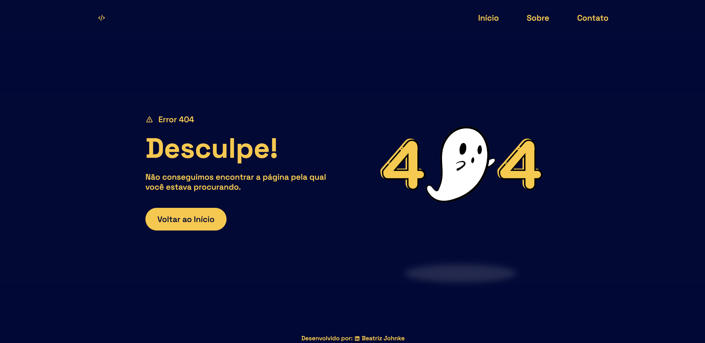

# ⚠️ Landing Page: Error 404

> O Erro 404 informa ao visitante do site que a página não pôde ser encontrada. Dessa maneira, este projeto foi pensado para criar uma página de erro personalizada para um site fictício.

[Deploy](https://error-page-zeta.vercel.app/).

### 💻 Tecnologias Utilizadas
  
